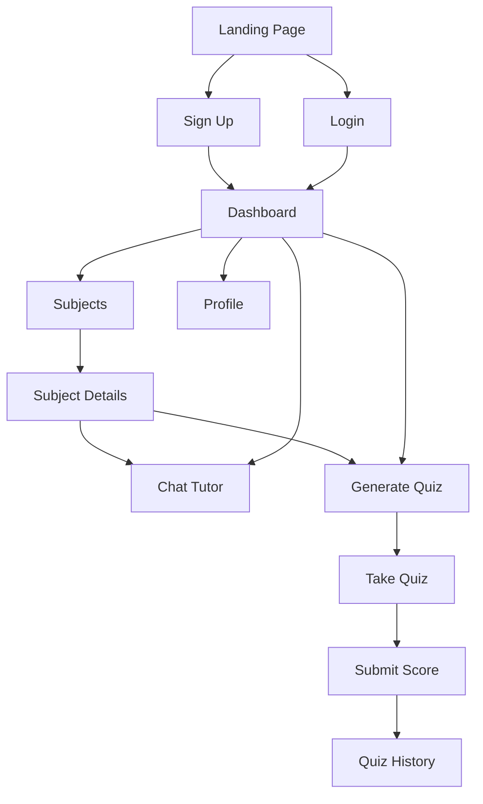

# StudyBuddy AI

An AI-powered education app where students can **chat with an AI tutor**, **generate quizzes on any topic**, and **track learning progress** across subjects like Math, Science, English, and Coding.

## Tech stack

- **Frontend**: Next.js (Pages Router), React, Tailwind CSS, Recharts
- **Backend**: Node.js, Express, JWT auth
- **Database**: MongoDB (Mongoose)
- **AI**: Google Gemini (via `@google/generative-ai`)

## Key features

- **Authentication**
  - Sign up / login
  - JWT-based protected routes (token stored in browser localStorage)
- **AI Chat Tutor**
  - Ask questions and get AI answers
  - Chat sessions saved to MongoDB (history + resume past sessions)
- **AI Quiz Generator**
  - Generate a 5-question multiple-choice quiz for any topic
  - Submit quiz score and store results
  - Quiz history and quiz detail view
- **Progress + Dashboard**
  - Dashboard summary: quizzes taken, average score, chat sessions
  - Subject-wise progress chart
- **Subjects**
  - Browse subjects stored in MongoDB
  - Optional DB seed script to load initial subjects

## Repo structure

```text
.
├─ backend/         # Express API + MongoDB models
├─ frontend/        # Next.js UI
├─ package.json     # Root scripts (run frontend+backend together)
└─ .gitignore
```

## Web flow diagram (user journey)



## System design diagram (high level)

```mermaid
flowchart LR
  U[User Browser] -->|HTTPS| FE[Next.js Frontend :3000]
  FE -->|fetch() with Bearer JWT| API[Express API :5001 /api]
  API --> DB[(MongoDB)]
  API -->|prompt/response| AI[Google Gemini API]

  subgraph Storage
    DB
  end
```

## API routes (backend)

All API routes are served from `http://localhost:5001/api` by default.

- **Auth**
  - `POST /auth/register`
  - `POST /auth/login`
- **Users**
  - `GET /users/profile` (protected)
  - `PUT /users/profile` (protected)
- **Subjects** (protected)
  - `GET /subjects`
  - `GET /subjects/:id`
- **Chat** (protected)
  - `POST /chat/ask`
  - `GET /chat/history`
  - `GET /chat/history/:id`
- **Quizzes** (protected)
  - `POST /quizzes/generate`
  - `POST /quizzes/:id/submit`
  - `GET /quizzes/history`
  - `GET /quizzes/:id`
- **Dashboard** (protected)
  - `GET /dashboard/stats`

## Getting started (local development)

### Prerequisites

- Node.js (LTS recommended)
- A MongoDB connection string (MongoDB Atlas works)
- A Google Gemini API key

### 1) Install dependencies

From the repo root:

```bash
npm run install-all
```

### 2) Configure environment variables

#### Backend (`backend/.env`)

Create `backend/.env` (do **not** commit it). Example:

```bash
PORT=5001
MONGO_URI=your_mongodb_connection_string
JWT_SECRET=your_long_random_secret
GEMINI_API_KEY=your_gemini_api_key
```

#### Frontend (`frontend/.env.local`)

Optional (defaults to `http://localhost:5001/api`):

```bash
NEXT_PUBLIC_API_URL=http://localhost:5001/api
```

### 3) Run the app

From the repo root:

```bash
npm run dev
```

- Frontend: `http://localhost:3000`
- Backend: `http://localhost:5001`

## Seeding subjects (optional)

To insert starter subjects into MongoDB:

```bash
cd backend
node seed.js
```

## Notes / security

- **Never commit secrets**: API keys, DB URIs, and JWT secrets must stay in `.env` files.
- **If a real key was ever committed or shared publicly**, rotate it immediately (generate a new key/secret).

## License

ISC (see `backend/package.json`).

